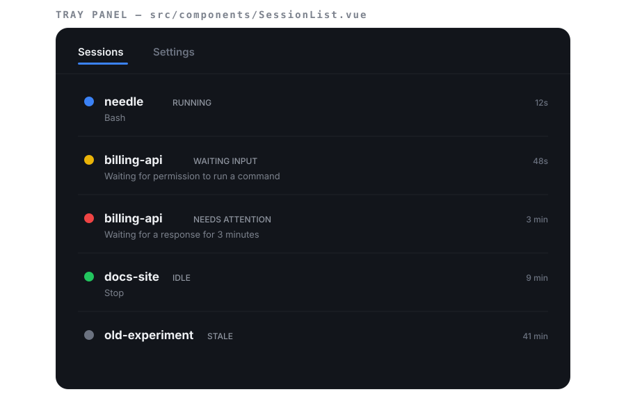
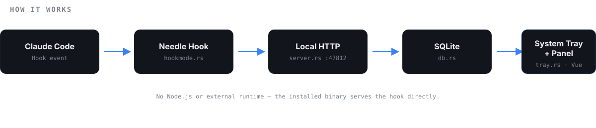

<p align="center">
  
</p>

<p align="center">
  <a href="../../releases"></a>
  
  
</p>

When multiple Claude Code sessions run in parallel, the annoying question is
always the same: **which one is waiting for my reply right now?** Needle lives
in the Windows tray and answers that at a glance — no terminal switching.

<p align="center">
  
</p>

## What it shows

- All active sessions, grouped by project.
- The state of each session, always one of these six: **running** · **waiting
  for input** · **needs attention** · **idle** · **error** · **obsolete**.
- Native Windows notification as soon as a session starts needing you.
- Tray icon reflecting the worst state among all open sessions — if the icon
  turns red, you already know something is pending.

## Installation

No prerequisites. No Node, Rust, or any runtime to install first.

1. Download the latest installer (`needle_x64-setup.exe`) from the
   [Releases](../../releases) page.
2. Run the installer — installs only for your user, without admin permission.
3. Open Needle once. It **self-configures automatically**: registers Claude
   Code hooks in `~/.claude/settings.json`, without touching hooks from other
   tools already there (and creates a backup before any write).
4. Done. Use Claude Code normally — the tray icon now reflects your sessions'
   states.

Click the tray icon to open the panel. The tray menu includes shortcuts for
**Settings**, **Reconfigure hooks**, and **Exit**.

## How it works

<p align="center">
  
</p>

Claude Code triggers native [hooks](https://docs.claude.com/claude-code) for
each session event. The Needle executable itself handles these hooks — when
called as `needle.exe hook`, it reads stdin payload and forwards it over local
HTTP to the running app. No Node, no external script, no dependency beyond
what was installed.

The app writes everything to local SQLite, recalculates session state, and
updates tray + panel in real time.

## Settings

From the panel's "Settings" tab (or from the tray menu):

| Option | What it does |
| --- | --- |
| "Needs attention" threshold | seconds waiting for input before status escalates |
| "Obsolete" threshold | minutes without any event before the session disappears from the list |
| Start with system | starts Needle with Windows |
| Hook status | shows whether hooks are registered, with buttons to reconfigure or remove |

## Development

Prerequisites: [Rust](https://rustup.rs) (MSVC toolchain), [Visual Studio Build
Tools](https://visualstudio.microsoft.com/visual-cpp-build-tools/) (C++
workload), Node.js 20+.

```bash
npm install
npm run tauri dev     # development mode
npm run tauri build   # generates NSIS installer at src-tauri/target/release/bundle/nsis
```

Backend tests:

```bash
cd src-tauri && cargo test
```

**Structure:**

- `src-tauri/src/` — local HTTP server, SQLite, state machine, tray,
  auto-hook setup, GUI-less `hook` mode.
- `src/` — panel (Vue 3 + TS): session list and settings screen.
- `hook/README.md` — hook details and manual/per-project configuration.

## License

[MIT](LICENSE)
